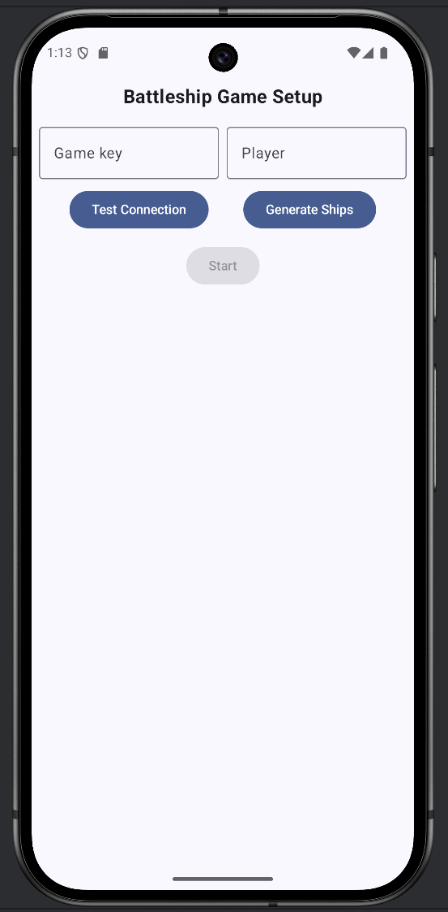
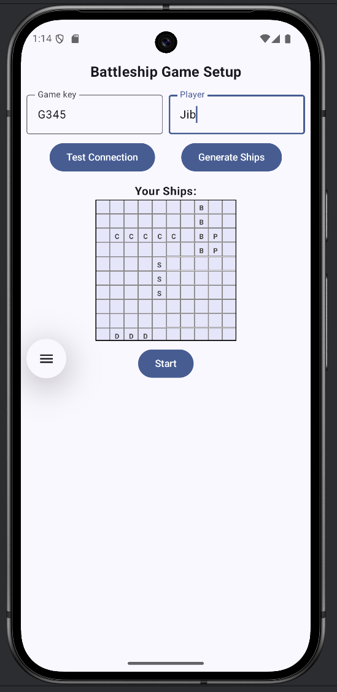
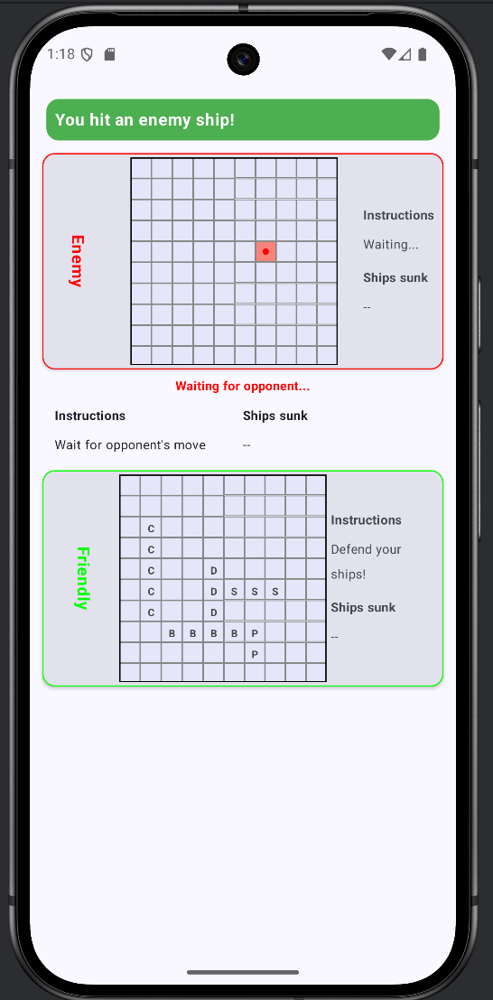
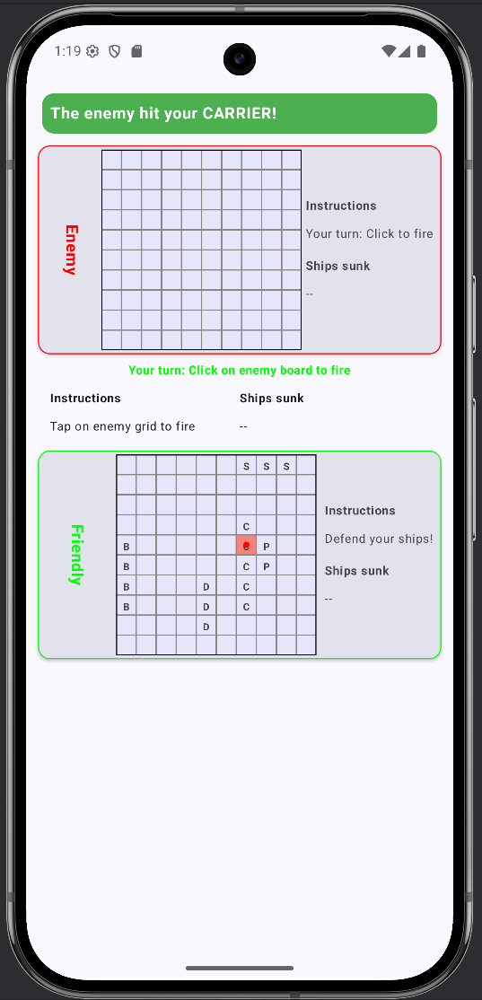

# BattleshipProject
The goal of the project is to create a client of the app that can play the classic Battleship game using the server http://javaprojects.ch:50003 . The game was developed as part of an elective course called "Mobile Applications with Android."

## Team Members
Jibin Mathew Peechatt and Sameh Ahmed.

The contributions of each team member are written out in the code through comments, and the use of AI tools is mentioned directly in the code.

## Description
The Battleship Project is an Android version of the classic Battleship board game. The game features an easy-to-use, intuitive user interface that allows players to engage in strategic naval warfare against other players through a central server at http://javaprojects.ch:50003, which was developed by Prof. Dr. Bradley Richards. Players can randomly place their ships on a grid by clicking the "Generate Ships" button and then take turns trying to sink their opponents' fleets by guessing their locations.

Key features of our game:
- Interactive game board with touch controls
- Real-time multiplayer functionality via a server connection built by Bradley.
- Random ship placement with a regeneration option until players are satisfied
- Server connection testing capability (for testing purposes, to quickly check whether the server is running).
- Visual feedback for hits and misses
- Game state persistence

### Visual representation of our game:



Initially, the game will look like this when the emulator is running.



The Start button would be enabled for players when the game key and player name have three characters and the ships have been placed in the grid using the Generate Ships button.



When a player makes a move and hits an enemy ship, they are given information about whether they hit or sank the ship.



Similarly, as shown in the above image, the other player/opponent would be notified that Player 1 hit their ship.

## Design
The game follows the MVVM (Model-View-ViewModel) architecture pattern and was developed using Android practices discussed in lectures with Prof. Dr. Richard Bradley. Below is a breakdown of how the components work together:

1. **Models (`models/`)**
   - `Ship`: Represents the ship with type, position, and orientation
   - `Position`: Represents coordinates on the game board (through X and Y)
   - `ShipType`: Enum defining different ship types and their sizes (Carrier, Battleship, etc...)
   - `Orientation`: Enum for ship placement (Horizontal/Vertical)
   - Request/Response models for server communication

2. **ViewModels (`viewmodel/`)**
   - `BattleshipViewModel`: Core game logic and state management
   - Manages game state transitions (Setup → InProgress → GameOver)
   - Handles player turns and move validation
   - Coordinates between UI and Repository layers
   - Implements polling mechanism for enemy moves

3. **Repository (`repository/`)**
   - `BattleshipRepository`: Handles all server communication
   - Implements the game operations (join, fire, check enemy moves)
   - Manages error handling and response parsing
   - Provides data validation before server requests

4. **Network (`network/`)**
   - `BattleshipApiService`: Defines REST API endpoints, as per the project documentation
   - Uses Retrofit for HTTP communication
   - Handles server connection and request/response mapping

5. **UI (`ui/`)**
   - `GameScreen`: Main game interface using Jetpack Compose
   - `SetupScreen`: Ship placement and game initialization
   - `GamePlayScreen`: Active gameplay interface
   - `GameOverScreen`: End game state

### Most important ideas in Implementation

1. **Game State Management**
   - Uses LiveData for reactive UI updates
   - Implements state machine for game flow control
   - Handles turn-based gameplay synchronization

2. **Server Communication**
   - RESTful API integration with server at http://javaprojects.ch:50003
   - Implements polling mechanism for enemy moves
   - Handles connection errors and timeouts
   - Validates server responses

3. **Ship Placement System**
   - Random ship generation with collision detection
   - Visual representation of ship positions
   - Orientation control (horizontal/vertical)

4. **Game Board Implementation**
   - Grid-based layout using Jetpack Compose
   - Separate boards for player and enemy
   - Visual feedback for hits, misses, and ship positions(through grid)
   - Touch interaction handling (we have only tested the game through emulator)

5. **Error Handling**
   - Comprehensive error handling for network operations
   - User-friendly error messages
   - Automatic reconnection attempts
   - Input validation (for example, with player name and game key)

### Interaction Flow

1. **Game Initialization**
   ```
   UI → ViewModel → Repository → Network → Server
   ```
   - Player enters name and game key (should be atleast 3 characters in length)
   - Ships are generated/placed in grid through Generate Ships button (can be clicked again to generate different placement)
   - Join game request is sent to server
   - Response determines player order

2. **Gameplay Loop**
   ```
   Player Move:
   UI → ViewModel → Repository → Network → Server
   ↓
   Enemy Move:
   Server → Network → Repository → ViewModel → UI
   ```
   - Player makes a move
   - Server processes move and updates game state
   - Polling mechanism checks for enemy moves
   - UI updates to reflect game state changes

3. **Game State Updates**
   ```
   Server → Network → Repository → ViewModel → UI
   ```
   - Real-time updates of board state
   - Ship status tracking
   - Turn management
   - Game over detection

## Usage

### Prerequisties
- Internet connection, as the game is multiplayer and requires connection with server
- Android Studio Ladybug (we have used this older version)
- Android SDK 35 (compileSdk)
- Minimum Android SDK 26 (minSdk)
- Target Android SDK 35 (targetSdk)
- Gradle 8.10.2

### How to Play
1. Open this project in your Android Studio
2. Sync the Project with the Gradle files
3. Build it and run the application on your emulator or android device (we have not been able to run to test it out on an android device)
4. Launch the application using MainActivity.kt
5. On the setup screen:
   - Enter your player name (minimum 3 characters) in the "Player" field
   - Enter the game key (minimum 3 characters) in the "Game key" field
   - Optional: Click the "Test Connection" button to verify server availability (it just pings the server)
   - Click the "Generate Ships" button to randomly place your ships on the grid
   - If you're not satisfied with the ship placement, click the "Generate Ships" button again for a new random arrangement
   - Once you're happy with the ship placement, click on the enabled "Start" button to start the game.
6. Wait to be matched with the opponent, you plan to play
7. Take turns with your opponent:
   - Tap on the opponent's grid to make a shot
   - Wait for your opponent's move
   - The grid will show the hits and misses on your board
8. The game ends, with a gameOver screen, when all ships of one player are sunk

### Intial Screen Features
1. **"Test Connection" Button**
   - Verifies server availability at http://javaprojects.ch:50003
   - This was created because we were facing availability issues between the servers "javaprojects.ch" and "brad-home.ch"
   - Provides immediate feedback on server status (through Log)
   - Useful for troubleshooting connection issues

2. **"Generate Ships" Button**
   - Located below the input fields of Player name and Game Key
   - Randomly places all five ships on your grid
   - Ensures valid ship placement with no overlaps
   - Can be clicked multiple times for different arrangements
   - Ships are placed according to standard Battleship rules, given per the project documentation:
     - Carrier (5 spaces)
     - Battleship (4 spaces)
     - Destroyer (3 spaces)
     - Submarine (3 spaces)
     - Patrol Boat (2 spaces)

3. **"Start" Button**
   - Enabled only when:
     - Player name is valid (3+ characters)
     - Game key is valid (3+ characters)
     - Ships are successfully placed
   - Initiates connection to the game server
   - Begins the multiplayer game session
